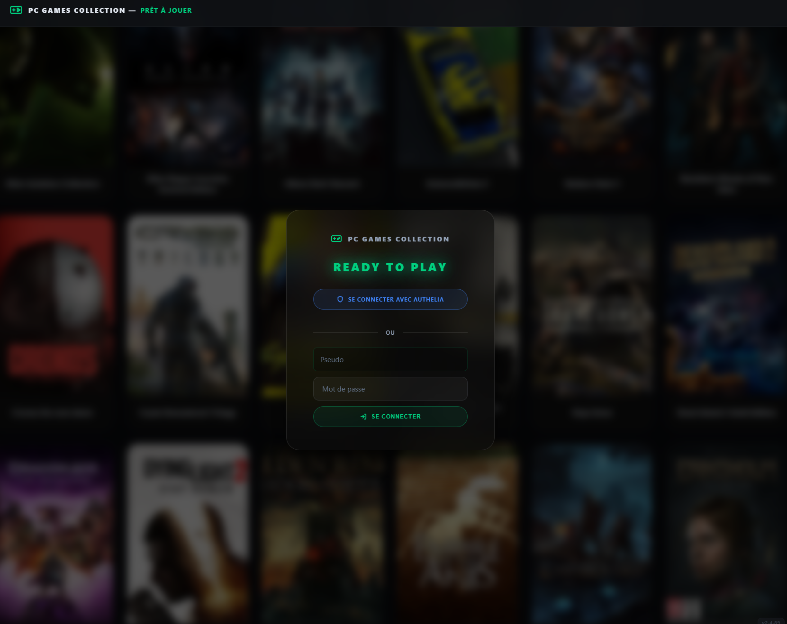
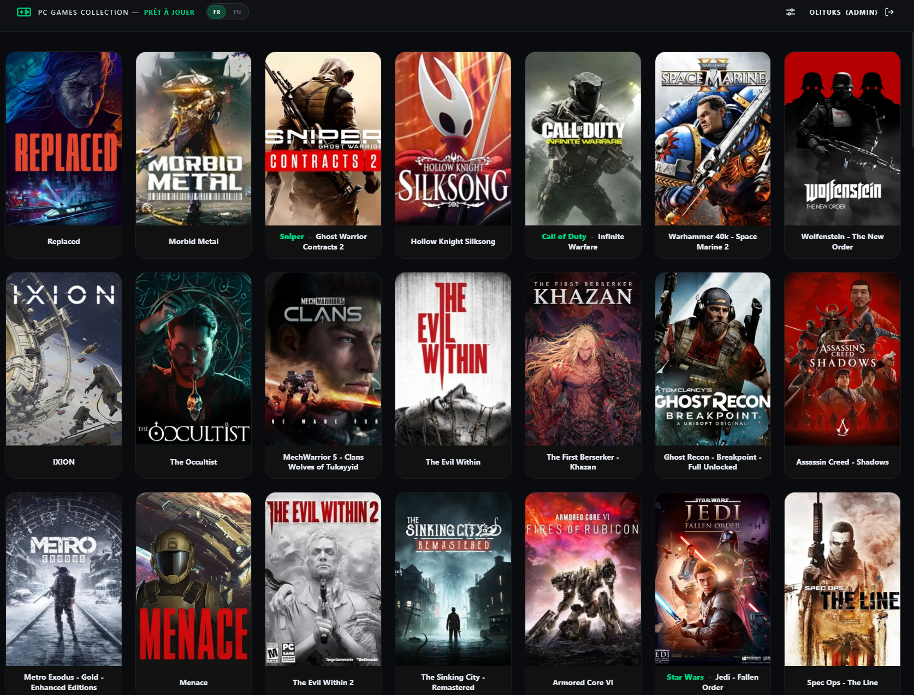
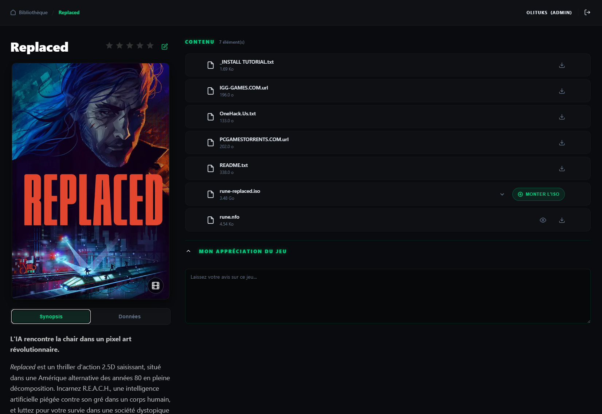

[English](#english) | [Français](#français)

<a name="english"></a>
# PC Games Collection Manager

[](https://www.python.org/)
[](https://fastapi.tiangolo.com/)
[](https://www.docker.com/)
[](LICENSE)

> A collection manager for PC games designed to be simple, elegant, and highly functional.

PC Games Collection Manager provides a "cosy" environment to organize your digital library, enrich your games with smart metadata via AI, and perform native system operations like ISO mounting through its dedicated local agent.







---

## Key Features

- **Library Management**: Automatic organization by folders, detection of ISO files and game archives.
- **AI & Metadata**: Automatic retrieval of information (genres, developers, release dates, synopsis, Steam/IGDB links) via an integrated Gemini AI service.
- **Advanced Filtering**: Ultra-precise multi-criteria search system (genres, tags, ratings, developers).
- **Game Collections**: Group your titles by franchises or series (e.g., *Resident Evil*, *The Witcher*).
- **Visual Search**: Instant visual feedback during search directly in the gallery header.
- **Rust Local Agent**: A dedicated system agent for native Windows operations.

### Rust Local Agent
The project includes a local agent written in Rust (`/rust_agent`) to handle operations that the web backend cannot perform directly:
- **Native ISO Mounting**: Mount disc images directly from the interface in one click.
- **PowerShell Tasks**: Execution of local scripts for advanced management.
- **Security**: Communication is secured via an **Auth Token** (baked into the agent configuration or passed during startup) to ensure only your instance can trigger operations.

#### Compilation
The agent is provided as source code to ensure transparency and security. To compile it:
1. Ensure you have the [Rust toolchain](https://rustup.rs/) installed.
2. Navigate to the `rust_agent/` directory.
3. Run `cargo build --release`.
4. The executable will be found in `target/release/rust_local_agent.exe`.

## Authentication & Security

Designed for self-hosted ecosystems:
- **OpenID Connect (OIDC)**: Native support for Authelia and other OIDC providers.
- **Security Headers**: Full CSP (Content Security Policy) protection.
- **Role Management**: Distinction between administrators (full control) and viewers.

## Technical Stack

- **Backend**: FastAPI (Python 3.12+), SQLAlchemy (SQLite), Alembic.
- **Frontend**: Jinja2 Templates, Vanilla CSS/JS (No heavy frameworks).
- **Metadata**: JSON Sidecar files for maximum portability.
- **Images**: Automatic generation of WebP and AVIF thumbnails for high performance.

## API Documentation

The application provides a comprehensive API documentation generated via Swagger UI. You can access it directly at:
`http://your-server-ip:8000/docs`

It includes all endpoints for library management, AI enrichment, and agent operations, organized by categories.

## Docker Deployment

```yaml
services:
  pc-games-manager:
    image: pc-games-collection-manager:latest
    container_name: pc_games_app
    volumes:
      - ./data:/app/data
      - /path/to/your/games:/app/library
    ports:
      - "8000:8000"
    environment:
      - OIDC_ENABLED=true
      - SERPER_API_KEY=your_key
      - GEMINI_API_KEY=your_key
    restart: unless-stopped
```

---

<a name="français"></a>
# PC Games Collection Manager (Français)

> Un gestionnaire de collection de jeux PC pensé pour être simple, élégant et hautement fonctionnel.

PC Games Collection Manager offre un environnement "cosy" pour organiser votre bibliothèque numérique, enrichir vos jeux avec des métadonnées intelligentes via l'IA, et effectuer des opérations système natives comme le montage d'ISO grâce à son agent local dédié.

---

## Fonctionnalités Clés

- **Gestion de Bibliothèque** : Organisation automatique par dossiers, détection de fichiers ISO et d'archives.
- **IA & Métadonnées** : Récupération automatique des informations (genres, développeurs, dates de sortie, synopsis, liens Steam/IGDB) via un service IA Gemini intégré.
- **Filtrage Avancé** : Système de recherche multi-critères ultra-précis (genres, tags, notes, développeurs).
- **Collections de Jeux** : Regroupez vos opus par franchises ou séries (ex: *Resident Evil*, *The Witcher*).
- **Recherche Visuelle** : Retour visuel instantané lors de la saisie de texte directement dans l'en-tête de la galerie.
- **Agent Local Rust** : Un agent système pour les opérations natives Windows.

### Agent Local Rust
Le projet inclut un agent local écrit en Rust (`/rust_agent`) pour gérer les opérations que le backend web ne peut pas effectuer directement :
- **Montage ISO Natif** : Montez vos images disque directement depuis l'interface en un clic.
- **Tâches PowerShell** : Exécution de scripts locaux pour une gestion avancée.
- **Sécurité** : La communication est sécurisée via un **Auth Token** (injecté dans la config ou passé au démarrage) pour garantir que seule votre instance peut piloter l'agent.

#### Compilation
L'agent est fourni sous forme de sources pour garantir transparence et sécurité. Pour le compiler :
1. Installez la [chaîne d'outils Rust](https://rustup.rs/).
2. Allez dans le dossier `rust_agent/`.
3. Lancez `cargo build --release`.
4. L'exécutable se trouvera dans `target/release/rust_local_agent.exe`.

## Stack Technique

- **Backend** : FastAPI (Python 3.12+), SQLAlchemy (SQLite), Alembic.
- **Frontend** : Templates Jinja2, Vanilla CSS/JS.
- **Métadonnées** : Fichiers "Sidecar" JSON pour une portabilité maximale.
- **Images** : Génération automatique de miniatures WebP et AVIF optimisées.

## Documentation de l'API

L'application expose une documentation complète de son API via Swagger UI. Elle est accessible à l'adresse :
`http://votre-ip-serveur:8000/docs`

Vous y trouverez l'ensemble des points d'entrée pour la gestion de la bibliothèque, l'enrichissement par IA et le pilotage de l'agent, regroupés par catégories.

---
*Développé avec passion pour les collectionneurs de jeux PC.*
